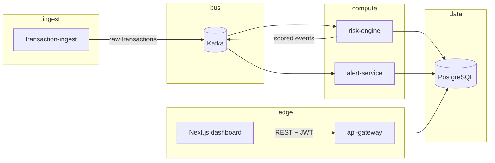

# sentinel-fraud-engine

> A real-time fraud detection and risk scoring platform built as event-driven microservices with a trainable scoring model and analyst-facing UI.

## Overview

Ingests payment-like events, scores them for fraud risk, persists an auditable trail, and raises alerts when scores cross policy thresholds. The shape matches what a fraud operations team expects: immutable transactions, explainable scores, alert workflow state, and HTTP APIs for tools and dashboards.

The problem is familiar: high volume, low fraud prevalence, tight latency budgets, and a regulatory expectation that you can explain why something was flagged. This codebase is a **reference implementation**: same separation of concerns you would use internally, scaled down for a laptop and CI-friendly builds.

## System design

Work is split so ingest, scoring, alerting, and read APIs can evolve and deploy independently. **Kafka** carries domain events between writers and readers; **PostgreSQL** holds system of record for transactions, scores, and alerts. The risk engine owns feature engineering for the live path and delegates probability estimation to a **sklearn** logistic regression artefact loaded at runtime (subprocess inference from Go).

Flow in words: **transaction-ingest** publishes normalised events to a raw topic; **risk-engine** consumes, writes the transaction and `risk_scores` row, publishes scored events; **alert-service** consumes scored events and inserts into `alerts` when rules fire; **api-gateway** serves authenticated reads and alert actions over REST; **frontend/dashboard** (Next.js) polls the gateway for an operations view.

## Architecture diagram



## Core components

**transaction-ingest**  
Responsibility: accept or synthesise transaction payloads, validate schema, publish to Kafka.  
Decisions: stateless ingress, fail fast on bad input, throughput-oriented concurrency (worker pattern in Go).

**risk-engine**  
Responsibility: consume raw events, derive features, run model inference, persist transaction + score, emit scored event.  
Decisions: idempotent write path keyed by transaction id; features computed in-process with a small in-memory user pattern cache (velocity, rolling location prior); subprocess call to Python for `predict_proba` so training and serving share one serialisation format.

**alert-service**  
Responsibility: consume scored stream, evaluate thresholds, write alert rows, optional downstream dispatch (e.g. webhook / log in this tree).  
Decisions: rule-based gating on top of the model (auditable policy separate from the classifier).

**api-gateway**  
Responsibility: JWT issuance (demo path), auth middleware on protected routes, rate limiting, JSON APIs for transactions, alerts, metrics.  
Decisions: token bucket limiter; CORS implemented as an outer wrapper so **OPTIONS** preflight always receives headers (avoids mux route mismatch on login).

**frontend (dashboard)**  
Responsibility: sign-in, poll transactions / open alerts / aggregate metrics, resolve alerts.  
Decisions: no server push on the gateway yet; polling keeps the contract simple for a portfolio deployment.

## Fraud scoring model

**Features (five, all in `[0,1]` before the linear model):** amount (log-scaled against a fixed cap), velocity (transactions per user in a rolling hour, capped), location deviation (Haversine distance to an EMA typical location, gated on minimum history), time anomaly (binary night window), merchant category risk (hand-tuned prior map with default).

**Model:** logistic regression (`class_weight='balanced'`, `lbfgs`), trained offline on synthetic labelled data. **P(fraud | x) = σ(w·x + b)**; **risk_score = round(100 × P)** clamped to 0-100.

**Why start here:** coefficients map directly to narrative for investigators and model risk; inference is cheap; you can swap the artefact for a stronger model later without changing the event contracts.

**Limitations:** synthetic training data does not represent production drift; subprocess inference is not how you would harden a bank stack (you would use a pinned model server, canary deploy, and signed artefacts); demo login on the gateway does not verify passwords against `users`.

Full maths and training hyperparameters: [ARCHITECTURE.md](./ARCHITECTURE.md) (section on risk score computation).

## Performance and scale

| Dimension | Design target | Notes |
|-----------|----------------|-------|
| Ingest / scoring throughput | mid 1k events/s class per partition lane | Bounded by Kafka consumer count, DB write capacity, and Python spawn cost in this implementation |
| Scoring path latency | single-digit to low tens of ms for feature + infer + insert | Excludes cross-region network; measured end-to-end needs instrumentation in your environment |
| Load generator (single process) | ~75 sustained publishes/s on a laptop | `tools/loadtest` is a client bottleneck; **99.98%** publish success observed in one 60s run (Kafka reliability, not model accuracy) |

Horizontal scale: add ingest and consumer replicas; partition Kafka topics by `user_id` (or merchant) to preserve per-key ordering; add read replicas or CQRS later if analyst queries contend with writes.

## Security considerations

- **Authentication:** HS256 JWT on protected API routes; secret from environment (rotate for anything outside local Docker).
- **Authorisation:** role claims exist for future RBAC enforcement; demo login issues tokens without bcrypt verification (called out in code).
- **Input validation:** typed parsing at ingest and gateway boundaries; reject malformed payloads early.
- **Rate limiting:** token bucket on gateway to cap abuse of read APIs.
- **Audit:** structured logs around scoring and alert creation; `risk_scores.feature_vector` JSON retains inputs for post-incident review.

## Observability

Services emit **structured JSON logs** (zerolog) suitable for central aggregation. Prometheus-style **/metrics** endpoints exist where exposed in Compose (exact ports depend on your `docker-compose` publish list). Operational debugging typically runs: consumer lag on scored topics, error rate on ingest, DB pool saturation, and inference latency histograms once you add them. The dashboard is a thin client; treat gateway and DB metrics as primary.

## Design decisions and tradeoffs

**Microservices vs monolith:** Chosen to mirror real fraud pipelines (different owners, different release cadence, blast-radius isolation). Cost: network hops, operational surface, and distributed debugging. A monolith would be faster to v0 but a weaker teaching artefact for institutional interviews.

**PostgreSQL vs document or wide-column stores:** Relational model fits ledger-like rows, foreign keys from alerts to transactions, and analyst joins. Cost: write path becomes the choke point before sharding or partitioning.

**Kafka vs in-process queues:** Durable log, replay, and consumer groups match how fraud stacks absorb spikes and reprocess after deploys. Redis Streams would work for smaller footprints; you lose some ecosystem tooling and retention semantics unless you engineer them.

**Real-time tradeoff:** strict ordering per partition vs global total order; you accept per-user serialisation, not global clock ordering.

**Where it breaks at scale:** single-row hot users, unbounded subprocess churn per score, and synchronous DB writes on the critical path. Mitigations: feature store service, batched writes, native inference (ONNX), and splitting read models.

## Failure handling

- **Duplicate events:** transaction insert uses idempotency; duplicate Kafka delivery should not double-score if the unique constraint wins (observe logs for skip path).
- **Out-of-order events:** per-partition ordering by key limits cross-message reordering; cross-partition ordering is not guaranteed.
- **Missing or corrupt data:** ingest rejects invalid JSON / schema failures; missing lat/lng zero out location features; unknown merchant category maps to a mid-risk default.

## Data model

- **transactions:** immutable financial event rows (amount, merchant, timestamps, optional geo, metadata JSON).
- **risk_scores:** one row per transaction, stores `fraud_probability`, integer `risk_score`, serialised feature vector, model version, timing metadata.
- **alerts:** investigation workflow state linked to a transaction and score, priority and status enums, resolution timestamps.

Detail: [DATABASE_SCHEMA.md](./DATABASE_SCHEMA.md).

## Tech stack

Go · PostgreSQL · Kafka · Next.js · Python (scikit-learn / joblib) · Docker Compose

## Running the system

**Prerequisites:** Docker with Compose, Go 1.21+, Node 18+ for the UI.

**Backend (recommended):**

```bash
git clone <repository-url> sentinel-fraud-engine
cd sentinel-fraud-engine
./start.sh
curl -s http://localhost:8000/health
```

Postgres is published on host **5433** (avoids clashing with a local 5432). Migrations run from `database/migrate.go`; seeds load dashboard users.

**Dashboard:**

```bash
cd frontend/dashboard
cp .env.example .env.local   # optional; default API http://localhost:8000
npm install
npm run dev
```

Browse to `http://localhost:3000`. Seeded analyst: `analyst@sentinel.com` / `sentinel123` (see `database/seeds/001_users.sql`).

**Tests and load:**

```bash
go test ./...
go run ./tools/loadtest/main.go --tps 1000 --duration 60 --brokers localhost:9092
```

The committed `ml/model/fraud_model_v1.0.0.joblib` keeps Docker builds working. Regenerate training CSVs and weights with `ml/training/generate_data.py` and `ml/training/train_model.py` (large data files stay gitignored).

## Further reading

- [ARCHITECTURE.md](./ARCHITECTURE.md)
- [DATABASE_SCHEMA.md](./DATABASE_SCHEMA.md)
- [frontend/dashboard/README.md](./frontend/dashboard/README.md)

## Licence

MIT licence. See the `LICENSE` file in the repository if present.
